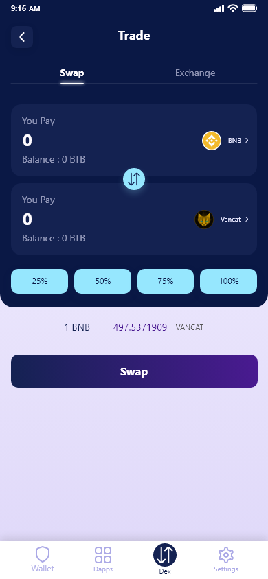
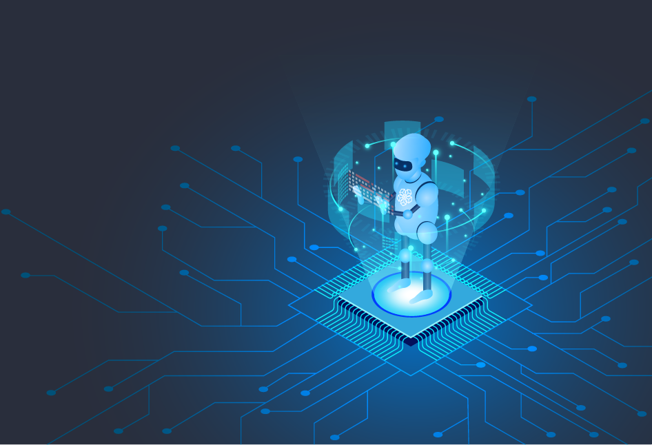

# Arab Gate Litepaper

## **All in One Gate**

Arab Gate is a non-custodial wallet that will connect billions of users around the world safely. Arab Gate offers multi-chain (NFT & cryptocurrency), DEX, Payment solutions & DApp Browser, and others.

Arab Gate is a key component of future multichain protocols/applications, acting as a single point of access to various DeFi services across multiple blockchains. By having variations on the wallet, we have established a solid platform for expanding our product suite.

**We built Arab Gate as our first product for these main reasons:**

* The wallet is the core component **** of any blockchain.
* We believe that a multi-chain wallet ecosystem is the core component of future multi-chain/cross-chain protocols.
* &#x20;People use different protocols/dapps for the same need, but they usually stick with only one wallet. Hence, a multichain wallet engine can become the moat factor of our upcoming products.
* A multi-chain wallet engine will facilitate the protocols/dapps to provide a better user experience and easier control of the product implementation process.&#x20;

### **Features**

**What makes Arab Gate stand out?**

#### **Hight security**

Your private keys can't leave your device. Using strong wallet encryption and cryptography, you can rest assured that your assets are safe and secure.

#### **Enhanced privacy/anonymity**

No KYC bureaucracy to access your assets, no IP association, no identity, no transactions tracking.

**Payment Solutions**

Gate Pay offers scalable payment solutions built for immediate transactions, fees that are fractions of a penny, and a net-zero environmental impact like Solana pay, Rollups, Bitcoin Lightning Network, and more.

#### **Buy assets with your card.**

Purchase Assets directly from Arab Gate through the use of our partners.

More options coming soon!

#### **DApp Browser & Web3 support**

Seamlessly access your favorite DApps with Arab Gate’s integrated DApp browser and Web3 support without any compromise on security.

#### **Multi-chain**

Full support for Bitcoin and other major altcoins and tokens. Coin selection and addition are done with the utmost care.

#### **NFT**

full support for ERC721, ERC1155, BEP721, BEP1155, TRC721, NEAR NFT, and SLP tokens, store, access, and manage your collectibles with peace of mind and security using Arab Gate’s innovative interface.

## **Arab Gate Ecosystem**

### **Gate Pay**

#### We see a different future for payments

Arab Network built Gate pay which offers multiple scalable payment solutions for crypto acceptance and spending.

#### Our Mission

Gate Pay is working to lead the blockchain payment technology by transforming how businesses and people send, receive, and store money around the Arab world.

#### Payment solutions

Gate Pay system offers multiple Scalable payments solutions and a universal settlement layer for moving token-based digital currencies.

#### Supported solutions :

| Solana Pay                                                                                                                                                           | Rollups (Hermez, zkSynk, Optimisme)                                                                                      | Bitcoin Lightning Network                                                                                            | Pay with the most popular crypto currencies                      |
| -------------------------------------------------------------------------------------------------------------------------------------------------------------------- | ------------------------------------------------------------------------------------------------------------------------ | -------------------------------------------------------------------------------------------------------------------- | ---------------------------------------------------------------- |
| The world’s most performant web3 ecosystem. Solana Pay is built for immediate transactions, fees that are fractions of a penny, and a net-zero environmental impact. | Make secure payments in digital currencies using Ethereum borderless infrastructure, reducing transfer fees by over 90%. | Gate Pay merchants and their customers will be able to complete cost-effective bitcoin transactions with lower fees. | Bitcoin, Ethereum, Litecoin, Dogecoin, Solana, Polygon and Usdt. |

#### Transparent Fees

No intermediaries fees, no hidden fees

ArabCoin holders will be able to use all Gate Pay payment solitons for free they only pay the network fees.

Non-stakeholders will pay an additional 0.1% + the network fees, making the Gate Pay fee policy the lowest in the payment gateways market.

Gate Pay offers scalable payment solutions built for immediate transactions, fees that are fractions of a penny, and a net-zero environmental impact like Solana pay, Rollups, Bitcoin Lightning Network, and more.

#### **Decentralized payments at scale**

Now your business can harness the power of the blockchain at the same speed as traditional payment networks. No more intermediaries. It’s just you and your customer.

### Arab Gate Exchange

Arab Wallet Exchange is a decentralized exchange that provides users with liquidity from various sources across many blockchains. A quick and secure swap with the best possible price and slippage.

The Arab Gate App and the Arab Gate Exchange are the next-generation products of Arab Network in our vision to optimize the user experience and drive mainstream adoption. All-in-one platform Arab Gate Exchange offers many services on multiple blockchains. Allowing users to exchange, stake, lend, borrow, and earn cryptocurrency easily while also having access to various services all in one platform. The goal of Arab Gate Exchange is to serve as a bridge between traditional Finance systems and decentralized financial systems (DeFi).

### **Hardware Wallet**

Arab Hardware wallet will be a decentralized, open-source hardware wallet with advanced security features.

Our electronic engineers are already working on the first prototype:

#### Architecture

.png>)

### **Hala AI Virtual Assistant**

Arab Network is building the world's first AI Virtual assistant for digital assets Named **Hala.**

**Send, receive and exchange crypto using only a friend's name**

**Introducing Hala**

**Hala** is an Artificially Intelligent virtual assistant for Digital Assets that was built to help Arab wallet users to send and receive assets directly by name or username. Anyone can send assets by simply saying for example "**Hala** Send $50 Bitcoin to Sharif". Hala also assists users to use any function in the Arab wallet.

**Hala** provides a smooth experience by allowing users to communicate naturally with the Arab wallet and use its services more effectively.

**Features**

**Speech recognition**

Hala can have an actual conversation with the user that will gather input and users' requirements and execute.

**Customized Personality**

Users can customize **Hala** (voice, and personality)

**User friendly**

Hala is easy to use, users can give instructions simply by just pushing the VA button.

## Roadmap

Q3 2021:

* Research about non-custodial wallets, and how they work.
* Research about full nodes
* Team buildup
* Design UI for the app
* Design Website UI
* Research about web3

Q4 2021:

* Start the development of Arab Gate.
* Deployment of multiple blockchains (Bitcoin, Ethereum, Polygon, Binance Smart Chain, Near Protocol, etc.)

Q1 2022:

* Launch the first version of the wallet on the website
* Add NFT List feature
* Add more cryptocurrencies to the app.
* New supported blockchains & tokens
* Research about hardware wallet

Q2 2022:

* Add referral marketing to the Arab Gate wallet
* Start developing Gate pay.&#x20;
* Start developing a web3 wallet
* Add the first scaling solution for Ethereum and Bitcoin to the Arab Gate wallet
* Research about Hala-AI
* New supported blockchains on Arab Gate wallet.
* Start development hardware wallet

Q3 2022:

* Launch Hala-AI-VA to Arab Gate wallet
* Launch Gate pay.
* Lunch the first version of the hardware wallet
* Research about cross-chain Dexs

Q4 2022:

* Arab Gate exchange test-net launch

## ArabCoin Tokenomics

**Initial Distribution**

The initial distribution of ArabCoin tokens is as follows:

* 33.6% for the Arab Network community and the Public Sale
* 12.5% to team members
* 10% for marketing
* 43.9% locked for the Community reserve fund (the Arab Network community manages the unlock (period & allocation) by voting)

| Phase       | Price (USD) | Token release schedule                                                                                          | Babylon Token airdrop |
| ----------- | ----------- | --------------------------------------------------------------------------------------------------------------- | --------------------- |
| Trench      | 0.035       | 35% of the tokens will be released at TGE (Token generation event), and the rest will be vested 20% each month. | 30%                   |
| MAS         | 0.05        | 40% of the tokens will be released at TGE, and the rest will be vested 25% each month.                          | 40%                   |
| Public Sale | 0.07        | 50% of the tokens will be released at TGE, and the rest will be vested at 25% each month.                       | 50%                   |

